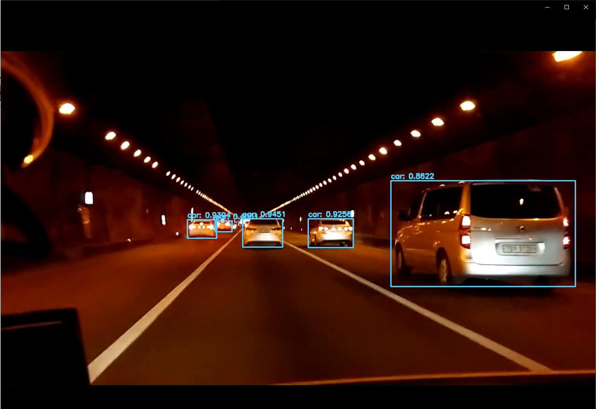
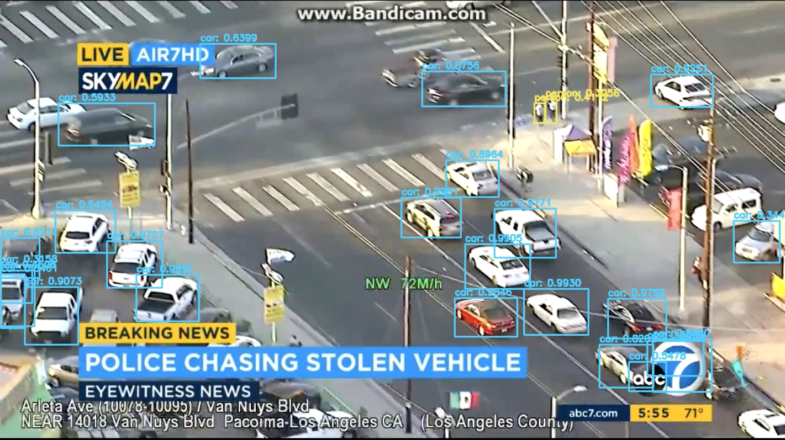

# Object-Detection-Using-yolov3
### Download Yolov3 weights and cfg
https://pjreddie.com/darknet/yolo/
Please paste the downloaded weight and cfg file in yolo-coco folder
### Command for detection in images
python yolo.py --image images/22.jpg --yolo yolo-coco
### Command for detection in videos
python yolo_video.py --input videos/finevideo.mp4 --output output/finevideo111.avi --yolo yolo-coco

